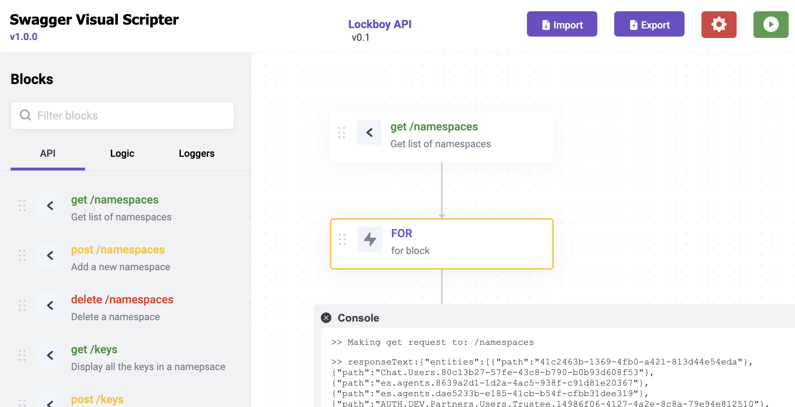

<!-- PROJECT LOGO -->
 
<!-- 

  

 -->

<!-- TABLE OF CONTENTS -->

  
Table of Contents

  <ol>
    <li><a href="#about-the-project">About The Project</a></li>
    <li><a href="#usage">Usage</a></li>
    <li><a href="#roadmap">Roadmap</a></li>
    <li><a href="#contributing">Contributing</a></li>
    <li><a href="#license">License</a></li>
    <li><a href="#contact">Contact</a></li>
    <li><a href="#acknowledgments">Acknowledgments</a></li>
  </ol>

<!-- ABOUT THE PROJECT -->
## About The Project

Swagger visual scripted allows creation of scripts using any valid Swagger v2 or OpenApi v3 json file.

(<a href="#readme-top">back to top</a>)

### Built With

Vanilla JS! That's right. This project has only one dependency.

* [Flowy-V2](https://github.com/AndrewGnagy/flowy-v2)

(<a href="#readme-top">back to top</a>)

<!-- USAGE EXAMPLES -->
## Usage
To start, load any valid JSON file describing your API.

### Variables
Pre-defined variables
* `$lastResult` - the response body of the most recent API request
* `$lastCode` - the response code of the most recent API request
* `$loopItem` - the current item in an iteration of a for loop

(<a href="#readme-top">back to top</a>)

<!-- ROADMAP -->
## Roadmap

- [ ] Package and minify project
- [ ] Convert a flowchart to JS script

(<a href="#readme-top">back to top</a>)

<!-- CONTRIBUTING -->
## Contributing

Contributions are what make the open source community such an amazing place to learn, inspire, and create. Any contributions you make are **greatly appreciated**.

If you have a suggestion that would make this better, please fork the repo and create a pull request. You can also simply open an issue with the tag "enhancement".
Don't forget to give the project a star! Thanks again!

Original contributors: Andrew Gnagy, Alex Ross, Francis Uzorh, and Davis Peterson from Genesys Inc.